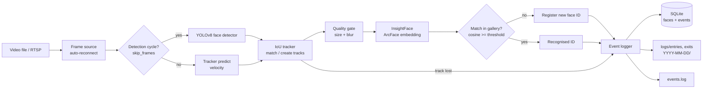

# Intelligent Face Tracker with Auto-Registration and Visitor Counting

Processes a video file (or a live RTSP stream), detects faces with **YOLOv8-face**, creates **InsightFace (ArcFace)** embeddings, tracks faces across frames, auto-registers new people, logs every **entry** and **exit** (image + timestamp + DB row + log line), and counts **unique visitors**.

Demo video: **<ADD YOUR LOOM / YOUTUBE LINK HERE>**

## Features
- YOLOv8 face detection, run every `skip_frames + 1` frames (set in `config.json`)
- ArcFace 512-d embeddings (InsightFace `buffalo_l`), cosine-similarity matching
- Automatic registration: new face -> new unique ID, stored in SQLite with timestamp and embedding
- Tracking between detection cycles (IoU + velocity prediction, Hungarian matching)
- Exactly one `entry` and one `exit` per appearance; each has a cropped image, timestamp, type, face ID
- Re-identification never increases the unique count
- Triple logging: `logs/events.log`, image folders `logs/entries|exits|registered/YYYY-MM-DD/`, SQLite
- Resilient: SQLite WAL + immediate commits, graceful shutdown (Ctrl+C) closes open tracks, RTSP auto-reconnect, identities reload from DB on restart
- Optional live preview window and annotated output video

## Architecture


Code layout:

| File | Role |
|---|---|
| `main.py` | CLI entry point, shutdown handling |
| `face_tracker/pipeline.py` | detect -> track -> identify -> log logic |
| `face_tracker/tracker.py` | IoU tracker and embedding gallery |
| `face_tracker/models.py` | YOLO detector and ArcFace recognizer wrappers |
| `face_tracker/database.py` | SQLite layer |
| `face_tracker/event_logger.py` | writes image + DB row + log line per event |
| `face_tracker/video.py` | file / RTSP input, overlay drawing |
| `tests/test_pipeline_logic.py` | model-free test of counting and entry/exit logic |

## Setup (Windows PowerShell)
```powershell
# Python 3.10 or 3.11 recommended
python -m venv .venv
.\.venv\Scripts\Activate.ps1
pip install -r requirements.txt
python scripts/download_models.py        # YOLOv8 face weights -> models/
```
If `pip install insightface` fails with "Microsoft Visual C++ 14.0 or greater is required", install **Microsoft C++ Build Tools** (Desktop development with C++) and retry.

Put the sample video at `data/sample.mp4` (or change `source` in `config.json`).

Linux / macOS: same steps, activate with `source .venv/bin/activate`.

## Run
```powershell
python main.py --reset-db --show                      # video file from config.json, with preview
python main.py --source data/sample.mp4 --reset-db    # headless
python main.py --source "rtsp://user:pass@IP:554/stream"   # live RTSP (interview)
python scripts/report.py                              # unique count + recent events from the DB
python tests/test_pipeline_logic.py                   # logic test, no models needed
```
Press `q` in the preview window or `Ctrl+C` to stop; open faces get their exit event before shutdown.

## config.json
```json
{
  "source": "data/sample.mp4",
  "device": "auto",
  "detection": { "model_path": "models/yolov8n-face.pt", "confidence": 0.5, "iou": 0.5,
                 "imgsz": 640, "skip_frames": 2, "min_face_size": 40 },
  "recognition": { "model_name": "buffalo_l", "similarity_threshold": 0.45,
                   "embedding_samples": 3, "min_blur_score": 20.0, "crop_margin": 0.3 },
  "tracking": { "iou_threshold": 0.25, "exit_after_frames": 30 },
  "storage": { "db_path": "data/face_tracker.db", "logs_dir": "logs",
               "log_file": "logs/events.log", "reset_db_on_start": false },
  "stream": { "rtsp_tcp": true, "reconnect_delay_seconds": 3, "max_reconnect_attempts": 0 },
  "output": { "show_window": false, "save_annotated_video": null }
}
```
Key knobs: `detection.skip_frames` (frames skipped between detections), `recognition.similarity_threshold` (lower = merges more people, higher = splits one person into several IDs), `tracking.exit_after_frames` (how long a face may vanish before it counts as an exit).

## Database
- `faces(face_id, first_seen, embedding, image_path)` - one row per unique visitor
- `events(event_id, face_id, event_type, timestamp, image_path, track_id, frame_index)`
- Unique count: `SELECT COUNT(*) FROM faces;`

## AI Planning Document
**Plan:** (1) read the problem statement and split it into modules: detection, recognition, tracking, logging, counting; (2) choose tech: YOLOv8-face, InsightFace, custom IoU tracker, SQLite; (3) build bottom-up: config -> DB -> logger -> models -> tracker -> pipeline -> CLI; (4) test the identity logic with fake models before using real ones; (5) tune thresholds on the sample video.

**Feature list:** face detection with configurable frame skipping; embedding generation; auto-registration; re-identification; tracking; entry/exit logging with images; events.log; DB storage; unique count; RTSP support with reconnect; graceful shutdown; optional preview and annotated video.

**Compute estimate (approximate, measure on your machine):**

| Stage | CPU (4-8 core laptop) | GPU (e.g. T4 / RTX class) |
|---|---|---|
| YOLOv8n-face @640 (per detection cycle) | about 25-60 ms | about 3-8 ms |
| ArcFace R50 + small landmark detector (per embedding) | about 50-120 ms | about 5-15 ms |
| Tracker, DB, logging | under 2 ms per frame | same |

Embeddings are computed only for the first `embedding_samples` detections of a track, so with `skip_frames = 2` the CPU cost is dominated by YOLO on every third frame. A CPU-only machine should manage roughly 10-20 FPS of video; a GPU is not required. RAM about 1.5-2 GB.

## Assumptions
- Frontal or near-frontal faces of at least `min_face_size` pixels; very small or blurry faces are skipped.
- "Entry" = a face is first detected and confirmed; "exit" = no detection for `exit_after_frames` frames, or the stream ends.
- The entry timestamp is the time of first detection (confirmation takes `embedding_samples` detection cycles). For video files, timestamps are start time + video position.
- If the same person leaves and returns, they get a new entry/exit pair but keep the same ID. If they reappear before the exit timeout, the old and new tracks are merged with no extra events.
- The default threshold 0.45 is a starting point; tune it on your video.
- Weights come from the public `akanametov/yolov8-face` release. Any YOLO face model can be used by changing `detection.model_path`.

## Sample output
After running on the sample video, copy `logs/events.log`, a few images from `logs/entries/` and `logs/exits/`, and `data/face_tracker.db` into a `sample_output/` folder and commit it.

---
This project is a part of a hackathon run by https://katomaran.com
